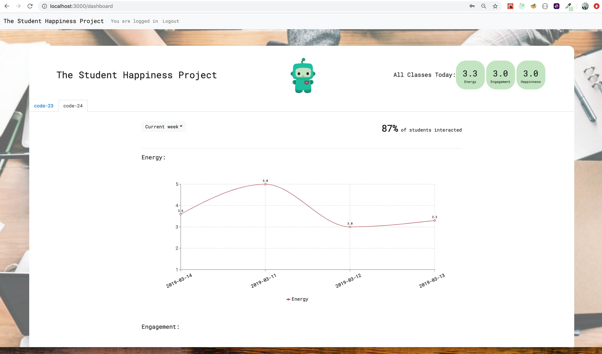

# Happiness Slackbot and Dashboard Project

## What this project is about
This was a group project from the Codaisseur Academy. We have created a slackbot, that asks three questions about student's energy, engagament and happiness. The bot saves the information to database and frontend app displays the data of the dashboard in three line charts.

I was responsible for the data visualisation, layout and style of the front-end app.

## Technologies used

#### Click links to view some samples in this project

- **[react](./client/src/components/dashboard/DashboardMain.js)**  
- **[redux](./client/src/reducers/dataForClass.js)**  
- **[redux-thunk](./client/src/actions/data.js)**
- **[recharts](./client/src/components/dashboard/ChartDisplay.js)**
- **[bootstrap](./client/src/components/users/SignupForm.js)**

      
## Goals for this project:

- To practice all recently gained technologies like React, Redux
- To practice something new, here Recharts and data visualisation
- To practice working on a project in a team
- **[To showcase disciplined git usage](#my-git-workflow)**

## My git workflow

In this project I try to use:

- Good commit messages
- Well named branches
- Pull requests with summaries

If you have feedback to improve my git usage: **[please drop me a line!](https://www.linkedin.com/in/izabelanow/)** 

